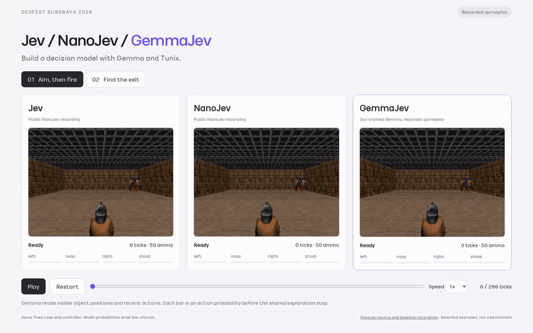
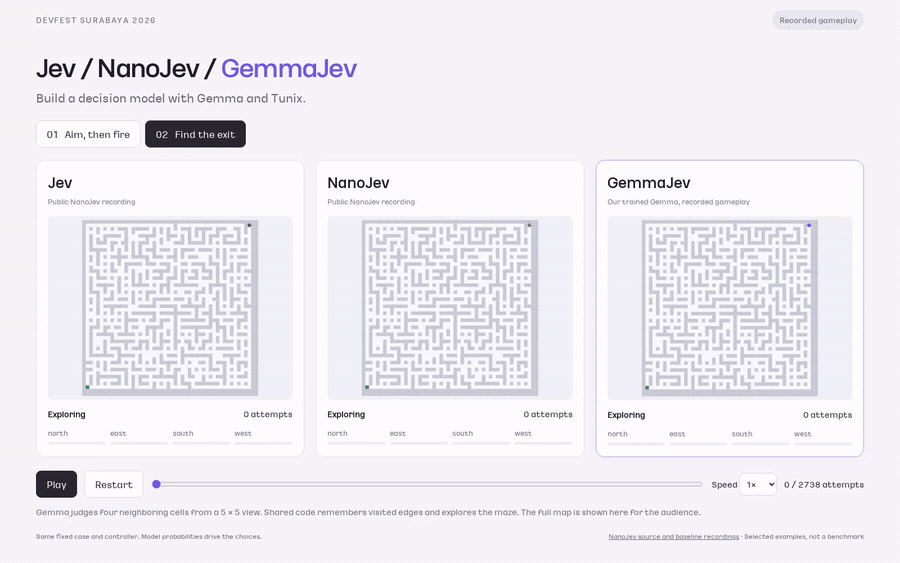
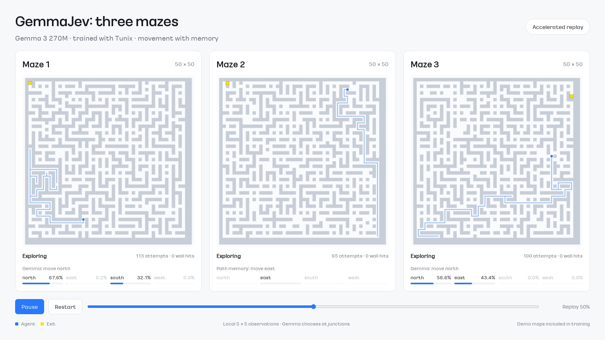

<h1 align="center">GemmaJev</h1>

<p align="center">Jev-style game decisions with Gemma 3 270M IT and Tunix.</p>

<p align="center">
  <a href="https://huggingface.co/bzantium/gemma-3-270m-jev"></a>
  <a href="https://huggingface.co/bzantium/gemma-3-270m-jev-mlx"></a>
  <a href="LICENSE"></a>
</p>

<p align="center">
  <a href="#demos">Demos</a> ·
  <a href="#models">Models</a> ·
  <a href="docs/interface.md">Input &amp; output</a> ·
  <a href="docs/training.md">Training</a>
</p>

Give the model an observation, a question and possible answers. It scores the
answers in a batch and returns probabilities, without decoding response tokens.
The examples build on [NanoJev](https://github.com/TianyuCodings/NanoJev).

## Demos

### ViZDoom · Aim, then fire

[](demos/media/vizdoom.mp4)

The model scores **left, right, shoot and noop** from a text observation.
The three panels replay Jev, NanoJev and our trained Gemma on the same scenario.

### Maze · Find the exit

[](demos/media/maze.mp4)

Gemma sees a **5×5 local window** and estimates whether each adjacent cell is
open. The shared controller explores and remembers paths; the full map is for
viewers.

### Maze · Navigate with memory

[](demos/media/three-mazes.mp4)

Gemma chooses a direction at junctions using the local view, goal offset and visit
history. Code handles walls, explored branches and backtracking. **These three
maps are included in training**: 441 of the 1,322 Maze movement examples come from
them. See the [data recipe and separate-map results](docs/navigation.md).

Watch all three recordings locally with just Python:

```bash
python3 -m http.server 8000 --directory demos
```

Open **http://localhost:8000**. No model download or GPU needed for playback.
The two comparison clips use the initial checkpoint; the three-maze clip uses
the movement-trained checkpoint. Videos are accelerated recordings, not live inference.

## Models

Both exports contain the same trained backbone and candidate head in FP32.

| Model | Runtime | Start here |
| --- | --- | --- |
| [gemma-3-270m-jev](https://huggingface.co/bzantium/gemma-3-270m-jev) | Transformers, CPU / CUDA | [Download and run](docs/huggingface.md#transformers) |
| [gemma-3-270m-jev-mlx](https://huggingface.co/bzantium/gemma-3-270m-jev-mlx) | MLX, Apple Silicon | [Run on a Mac](docs/huggingface.md#mlx) |

Weights are private during review and require Hugging Face access. These are
candidate-scoring models; use the supplied adapter instead of a chat or text-generation
pipeline. The weights follow the Gemma terms, separately from the code license.

## How it works

```text
State + question + candidate A → Gemma → scalar score A
State + question + candidate B → Gemma → scalar score B
                  ...                       ↓
                                 softmax over candidates
                                            ↓
                                 code builds the response
                                            ↓
                                      game controller
```

Candidates are processed together in a batch on the same model. There is no
autoregressive decoding of a JSON answer: [model.py](gemmajev/model.py) scores
each candidate's final token representation, and
[interface.py](gemmajev/interface.py) pairs probabilities with candidate names.
[train.py](scripts/train.py) trains the backbone and head with Tunix's custom
cross-entropy loss. The controller decides how to turn the response into actions.

```python
import json
from pathlib import Path
from gemmajev.transformers_backend import TransformersGameEngine

engine = TransformersGameEngine("artifacts/gemma-3-270m-jev")
request = json.loads(Path("examples/navigation_request.json").read_text())
response = engine.predict(request)
print(json.dumps(response, indent=2))
```

After [downloading the model](docs/huggingface.md), this executes inference.
See [Maze and Doom requests and recorded responses](docs/interface.md), or the
[Mac setup](docs/mlx.md) for an MLX export.
Trained [Transformers and MLX weights](docs/huggingface.md) are hosted on Hugging
Face; they are not stored in this Git repository.

### Relationship to Jev

[Jev](https://docs.typesafe.ai/concepts/system-one) is TypeSafe's System One model
for fast, typed decisions. This project implements a small game-specific
candidate scorer inspired by Jev and NanoJev. It uses supervised training, not
TypeSafe's RLCD, and does not reproduce Jev's proprietary architecture. The
returned probabilities have not been validated as calibrated confidence.

## Train and run

Start with [setup and the base checkpoint](docs/training.md), then follow the
[movement recipe](docs/navigation.md) to reproduce the three-maze model. The
[game guide](docs/demos.md) covers running and recording both interfaces. Training
uses one GPU; checkpoints, data and caches stay inside this repository.

| Check | Result | Scope |
| --- | --- | --- |
| Maze next direction | 70.4% accuracy | 196 validation questions on four separate maps |
| ViZDoom action | 90.0% accuracy | 201 validation questions |
| MLX FP32 inference | 35.1 ms | One movement question, ten warm calls on an M2 Max |

Question accuracy and inference timing do not establish navigation quality.
See [gameplay results and measurement details](docs/results.md).

## Code

```text
gemmajev/      Model, question interface, JAX, Transformers and MLX inference
scripts/       Fetch data, prepare inputs, train and evaluate
examples/      Run games or send a single request
demos/         Ready-to-watch recordings, no model required
web/           Templates for replaying your own game traces
tools/         Benchmarks, replay builders and video recording
```

[Development](docs/development.md) · [Training configs](configs)

## Acknowledgments

[Jev](https://typesafe.ai/blog/introducing-system-one-models-and-jev),
[NanoJev](https://github.com/TianyuCodings/NanoJev) and
[JevHarness](https://github.com/TianyuCodings/JevHarness) inspired this project.
Built with [Gemma](https://ai.google.dev/gemma),
[Tunix](https://github.com/google/tunix) and [MLX](https://github.com/ml-explore/mlx).

Code: [Apache-2.0](LICENSE). Models, game assets and datasets retain their own
terms; see [NOTICE](NOTICE) and [demo credits](demos/README.md).
